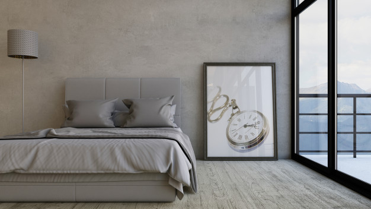
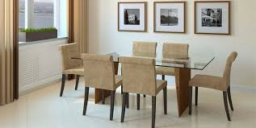

#  **CUADROS EN CASA**

Si queremos hacer un cambio nuestro hogar podemos reubicar cuadros y fotos, cambiar algún [marco](http://www.turomarc.com/) o exhibirlos de otra manera.
En cuanto a la disposición hay muchas formas de agrupar cuadros, por temática, colores, si tienen el mismo marco y tamaño o si tienen diferentes orientaciones.
Evite colocar cuadros en todas las paredes sin ningún orden, la mejor forma de colgar cuadros es generar áreas definidas.
Una regla básica en distribución de cuadros es mantenerlos a la altura del observador. Se debería poder trazar una línea imaginaria que cruce por el medio de todos los cuadros, al nivel de los ojos.( entre 1,50 y 1,60m.) .
También si los cuadros son grandes pueden colocarse en el suelo, tendencia que empezó hace algunos años y todavía perdura.
Si vamos a colgar un cuadro sobre un mueble bajo (un sillón, cama, cómoda, chimenea, etc.) no debe quedar pegado al mueble, la relación siempre debe ser que el cuadro esté más cerca del mueble que del techo. Tener en cuenta que el cuadro colocado sobre un mueble nunca debe ser más ancho que el mueble. Si queremos lograr un diseño más dinámico entonces podemos desplazar el cuadro hacia uno de los laterales.

**Colocación simétrica**

Esta distribución sugiere orden y es fácil de realizar.
Hay simetría en la distribución de cuadros cuando podemos, dividir la distribución en dos partes iguales y opuestas mediante un corte horizontal o vertical. La distribución de cuadros en forma simétrica permite diferentes opciones: en línea horizontal o vertical, en doble o triple línea horizontal o vertical, formando figuras geométricas.

**Colocación en línea**

Los cuadros en línea son útiles para modificar la percepción de un espacio. En espacios estrechos y reducidos conviene colocar los cuadros verticalmente ya que una línea vertical de cuadros crea la ilusión óptica de un techo más alto. Las líneas horizontales son adecuadas para pasillos y áreas largas, también sobre muebles alargados, siguiendo la línea del mueble.

**Agrupación por radiación**

Los cuadros “desordenados” con diferentes tamaños y temática, se agrupan generalmente colgando un primer cuadro central y los demás alrededor de este.
Esta elección puede ser más creativa y normalmente produce un gran impacto visual, aunque es más arriesgada y debe ser armoniosa en su conjunto.

