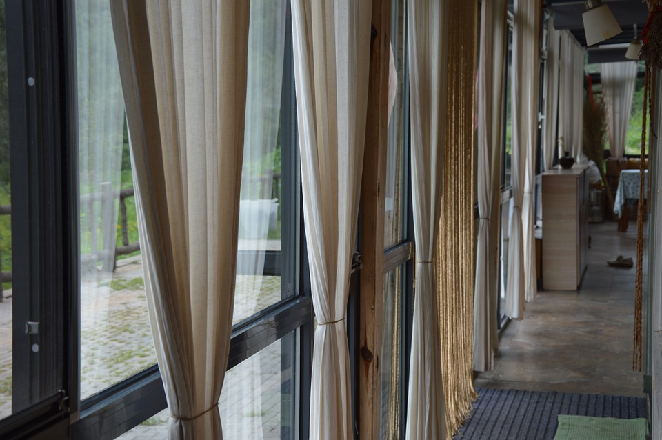
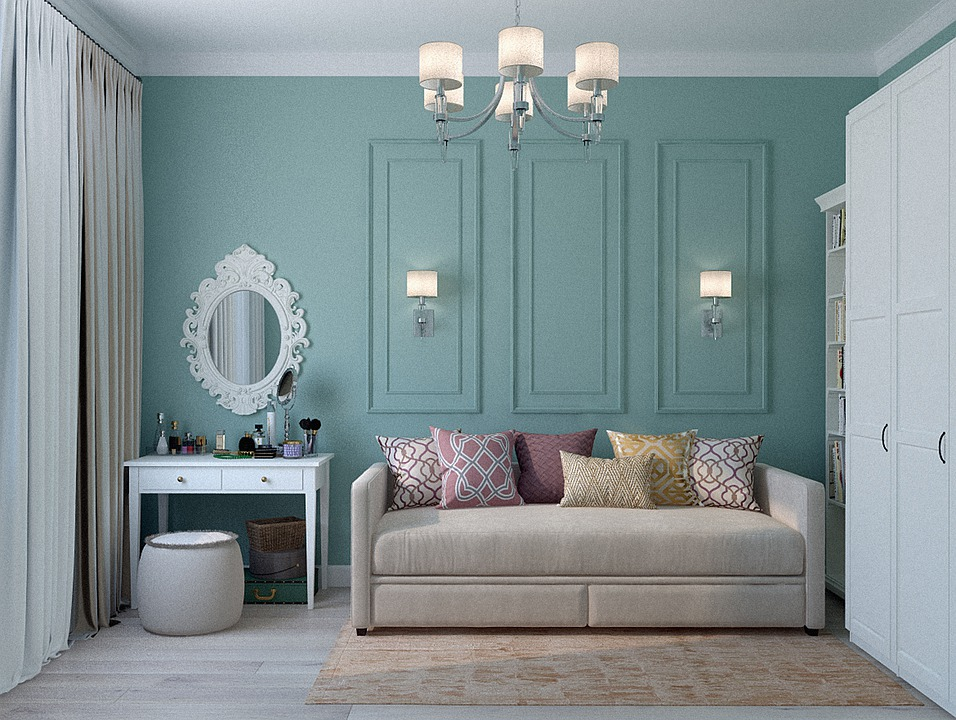
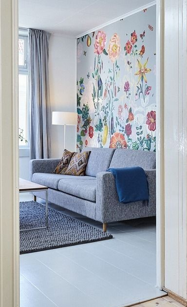
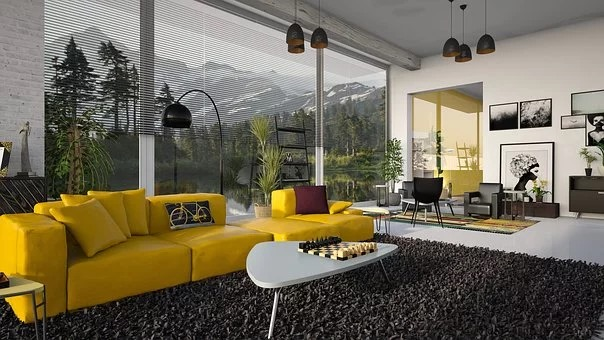

## **A RENOVAR LOS TEXTILES!!**

Los textiles de la vivienda son una parte muy importante de la decoración, pueden cambiar completamente la imagen de una estancia.

**CAMBIA LAS CORTINAS**

Un cambio muy eficaz para dar un nuevo aspecto a la casa es cambiar las [cortinas](https://www.labotigueta.es/). Podemos aprovechar para revisar la instalación, las cortinas deben colocarse lo más altas posible para dar sensación de amplitud y si no lo hemos hecho desde el principio, dejar que la barra de cortina sobresalga unos 15cm a cada lado de la ventana para que cuando las cortinas estén abiertas no tapen la entrada de luz.

Ten en cuenta el tipo de textil elegido ya que marcará el ambiente dentro de la habitación; algodón o lino son telas frescas para ambientes naturales; gasa o seda son telas más románticas, que quedan muy bien en dormitorios; terciopelo y jacquard son sofisticadas, encajan bien en salones y comedores más elegantes.

Depende del estilo podemos sustituir las cortinas tradicionales por enrollables, panel japonés, plegables o venecianas logrando un ambiente más actual. El tejido Screen es el más utilizado ya que mejora la eficiencia energética pero también se utilizan tejidos opacos si queremos mantener la oscuridad y translúcidos para mantener la privacidad sin perder la entrada de luz.

Las [cortinas enrollables](https://www.cortinas-solart.com/) pueden ser de accionamiento manual o motorizado ,con pulsador o mando a distancia. 

**ESTRENA SOFÁ**

Las [tapicerías](https://gancedo.com) marcan el estilo decorativo, por eso es importante acertar en su elección: lisas, estampadas, oscuras o claras.
Renueva las fundas de los sofás y parecerán nuevos sin cambiarlos. Confecciona la funda a medida con telas resistentes, especiales para tapizar, que soporten mejor el desgaste y resulten más fáciles de limpiar.
Toma bien las medidas y ajusta las fundas con cintas o velcro.

**RENUEVA LOS COMPLEMENTOS**

Si no quieres cambiar las fundas del sofá, cambia el decorado. Con una colección de [cojines](https://calmahouse.com/es/), que puedes intercambiar cada día, tendrás para elegir. Combina los estampados y los lisos, cuadrados, rectangulares o redondos de diferentes tamaños, pero siempre de tamaño estándar y siguiendo una paleta cromática.
Siempre que quieras darle un nuevo aire al sofá del salón basta con cambiar los cojines por una selección coordinada y rematar con un plaid o mantas.

**GANA CALIDEZ CON ALFOMBRAS**

Al igual que las paredes, el suelo de las habitaciones nos crea el ambiente y una alfombra es el complemento ideal para crear un espacio renovado, aportando calidez y confort.
Hay que medir bien el espacio a cubrir y asegurarnos de que englobe a todo el mobiliario de la zona. Es importante que al menos las patas delanteras de los sofás y las butacas pisen la alfombra y, en la zona del comedor, las sillas deben permanecer siempre dentro de ella.
Invierte en una alfombra de mucha calidad , de lana o seda tipo [oriental](https://www.expoalfombrairan.com/) o de yute; también puedes actualizar una alfombra que ya tengas con un ribete en un tono más intenso. Antes de elegirla, piensa si quieres que se convierta en una [pieza protagonista](https://nanimarquina.com/es/), con un diseño  marcado que predomine y de estilo clásico o si prefieres que se vean integradas en el conjunto, con acabado liso y preferiblemente de colores neutros 
En cuanto a los colores, depende del efecto que quieras conseguir
Si el suelo es claro, algo más intensa y si es oscuro, más clara. Aunque no es necesario contrastar la alfombra con el suelo. Para ganar continuidad visual, podemos utilizar tonos que se asemejen al color del suelo o decantarnos por blancos rotos o grises perla”.

Renovando tu alfombra, tus cojines, tus cortinas…  tu casa se verá como nueva.

