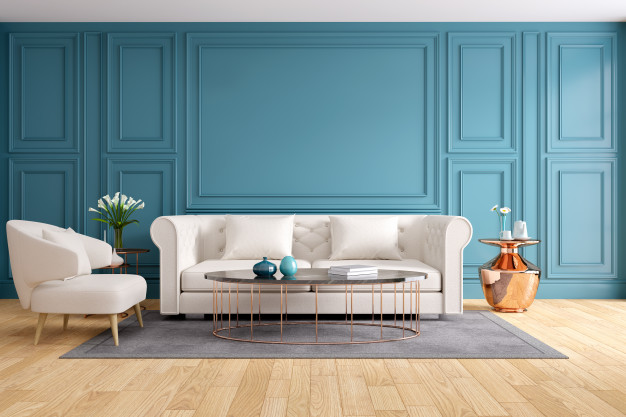
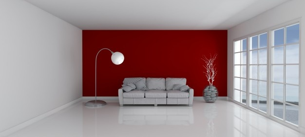

**UN TOQUE DE COLOR**

La [pintura](https://www.bruguer.es/es/color-del-2020-bruguer) es nuestra gran aliada para conseguir un cambio inmediato.
Puedes darle más personalidad y estilo a tu salón pintando una de sus paredes en un color contrastante o de un tono más subido, dentro de la gama predominante, si no te atreves a tanto.

Y no sólo las paredes marcarán la diferencia, también puede ser ese mueble que compraste hace tiempo y que ya no te agrada tanto o una estantería que cambiaría radicalmente con un color vibrante para animar el ambiente o al revés, pintándola del mismo tono de la pared para que se camufle con ella.
¿Y si cambias el color de las puertas o las ventanas? Puedes darle nueva vida pintándolas de blanco o gris oscuro o en un color que llame la atención.

También podemos pintar los armarios de la cocina o los [azulejos](https://www.titanlux.es/es/productos/producto/pinturas-azulejos) del baño.

Con un poco de habilidad y ganas podemos darle un toque de originalidad al ambiente. La única precaución es cubrir bien el espacio alrededor y utilizar cinta de pintor para definir la zona a pintar.

**PIENSA, IMAGINA, PINTA!!!**

